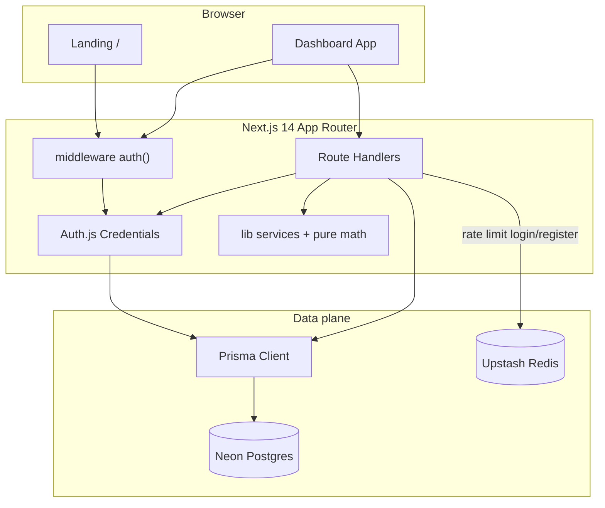

# DevLevel

[](https://nextjs.org/)
[](https://www.typescriptlang.org/)
[](https://www.prisma.io/)
[](https://authjs.dev/)
[](https://vitest.dev/)
[](https://pnpm.io/)

> Behavioral tracking for developers — daily journal, gamification, and experiments with statistical correlation.

**Versão em português:** [README.md](./README.md)

---

## The story: the keystone habit

In *The Power of Habit*, Charles Duhigg describes the **keystone habit**: one practice that unlocks change elsewhere. DevLevel applies that metaphor to a software career.

The loop **log the day → reflect weekly → run experiments** is the keystone: it pulls deep work, interruption management, technical autonomy, and deliberate learning. This is not just a journal — it is a behavioral feedback system with XP, streaks, and correlation between compliance and outcomes.

---

## Features

| Area | What it does |
|------|----------------|
| Daily journal | Typed entries (project / incident / study) with autonomy, difficulty, deep-work flags |
| Gamification | XP, levels, streaks; aggregates on `User` for O(1) reads |
| Weekly reflection | Full CRUD |
| Experiments | Behavioral hypotheses + compliance log + **Pearson correlation** |
| Auth | Auth.js v5 Credentials, httpOnly cookie, Secure in production |
| Security | Upstash rate limit, Zod env validation, CSP / X-Frame-Options headers |

---

## Architecture



---

## Stack

- **App:** Next.js 14 (App Router), React 18, TypeScript, Tailwind CSS
- **DB:** PostgreSQL + Prisma (Neon / any serverless Postgres)
- **Auth:** Auth.js v5 (Credentials) + bcryptjs
- **Rate limit:** Upstash Redis with graceful local fallback
- **Charts:** Recharts
- **Tests:** Vitest
- **Package manager:** pnpm

---

## Main challenges (before → after)

| Problem | Before | After |
|---------|--------|-------|
| Fragile session | Middleware only checked cookie **presence**, not JWT validity | Auth.js validates session in middleware via `auth()` |
| Rate limit | In-memory `Map` — broken on multi-instance serverless | Upstash sliding window + no-op when Redis is unset |
| XP at scale | Full-scan of all entries on every dashboard read | `xpTotal` / streaks on `User`, updated in the same write transaction |
| Correlation | Chart series only, no coefficient | Pure Pearson in `lib/utils/correlation.ts` + unit tests |
| Reflections | No PATCH/DELETE | Full CRUD in API and UI |

### Conscious trade-off: aggregated XP

Entry writes recalculate XP and streak inside `prisma.$transaction` and persist on `User`. Dashboard reads use those fields — **O(1)** on the hot path. The write path may still scan entry dates for streaks; we accept write cost for fast, consistent reads.

---

## Technical decisions

| Decision | Why |
|----------|-----|
| Postgres + Prisma | Relational data; versioned migrations; end-to-end types |
| Auth.js over homemade JWT | Avoid reinventing session cookies (where the bug lived) |
| Upstash | Rate limiting that works on Vercel/serverless |
| ComplianceLog as a table | Clean queries and unique `(experimentId, date)` |
| pnpm | Deterministic installs |
| Vitest | Real domain tests (XP, streak, Pearson, register flow) |

---

## Local setup

### Prerequisites

- Node.js 20+
- pnpm 9+
- [Neon](https://neon.tech) account (or local Postgres / Supabase)

### 1. Install

```bash
pnpm install
```

### 2. Environment

Copy `.env.example` → `.env.local`:

| Variable | Required | Description |
|----------|----------|-------------|
| `DATABASE_URL` | Yes | Postgres connection string |
| `AUTH_SECRET` | Yes | `openssl rand -base64 32` |
| `AUTH_URL` | Recommended | `http://localhost:3000` |
| `UPSTASH_REDIS_REST_*` | No | Production rate limiting |

### 3. Database

```bash
pnpm db:migrate
pnpm seed
```

**Demo credentials:** `demo@devlevel.app` / `demo1234`

### 4. Run

```bash
pnpm dev
```

### Tests and build

```bash
pnpm test
pnpm build
```

---

## Roadmap

- [ ] OAuth (GitHub / Google)
- [ ] CSV export
- [ ] Weekly insights from reflections
- [ ] PWA / journal reminders
- [ ] Team mode (coach ↔ mentee)

---

## License

MIT — portfolio project.
