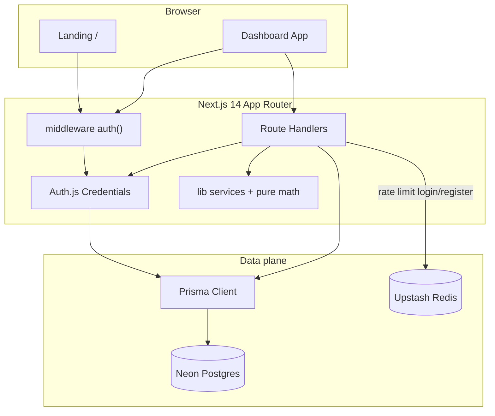

# DevLevel

[](https://nextjs.org/)
[](https://www.typescriptlang.org/)
[](https://www.prisma.io/)
[](https://authjs.dev/)
[](https://vitest.dev/)
[](https://pnpm.io/)

> Tracking comportamental para desenvolvedores — journal diário, gamificação e experimentos com correlação estatística.

**English version:** [README.en.md](./README.en.md)

---

## A história: o hábito angular

Em *O Poder do Hábito*, Charles Duhigg descreve o **hábito-chave** (keystone habit): uma prática que desencadeia mudanças em outras áreas da vida. DevLevel nasceu dessa metáfora aplicada à carreira de software.

O loop de **registrar o dia → refletir na semana → experimentar hipóteses** é o hábito angular: ele puxa deep work, gestão de interrupções, autonomia técnica e aprendizado deliberado. O produto não é só um journal — é um sistema de feedback comportamental com XP, streaks e correlação entre compliance e resultados.

---

## Funcionalidades

| Área | O que faz |
|------|-----------|
| Journal diário | Entradas tipadas (projeto / incidente / estudo) com autonomia, dificuldade e flags de deep work |
| Gamificação | XP, níveis e streaks; totais agregados no usuário (leitura O(1)) |
| Reflexão semanal | CRUD completo de reflexões por semana |
| Experimentos | Hipóteses comportamentais + log de compliance + **correlação de Pearson** |
| Auth | Auth.js (NextAuth v5) Credentials, cookie httpOnly, Secure em produção |
| Segurança | Rate limit Upstash, validação Zod de env, headers CSP / X-Frame-Options |

---

## Arquitetura



---

## Stack

- **App:** Next.js 14 (App Router), React 18, TypeScript, Tailwind CSS
- **DB:** PostgreSQL + Prisma (Neon / qualquer Postgres serverless)
- **Auth:** Auth.js v5 (Credentials) + bcryptjs
- **Rate limit:** Upstash Redis (`@upstash/ratelimit`) com fallback local
- **Charts:** Recharts
- **Tests:** Vitest
- **Package manager:** pnpm

---

## Principais desafios (antes → depois)

| Problema | Antes | Depois |
|----------|-------|--------|
| Sessão frágil | Middleware só checava se o cookie **existia**, sem validar JWT | Auth.js valida a sessão no middleware via `auth()` |
| Rate limit | `Map` em memória — quebra em serverless multi-instância | Upstash Redis sliding window + no-op gracioso sem Redis |
| XP em escala | Full-scan de todas as entries a cada leitura do dashboard | Campos `xpTotal` / streaks no `User`, atualizados na mesma transação do write |
| Correlação | Só séries no gráfico, sem coeficiente | Pearson puro em `lib/utils/correlation.ts` + testes unitários |
| Reflections | Sem PATCH/DELETE | CRUD completo na API e na UI |

### Trade-off consciente: XP agregado

Writes de entry (create/update/delete) recalculam XP e streak dentro de `prisma.$transaction` e persistem no `User`. Leituras do dashboard usam esses campos — **O(1)** no caminho quente. O write path ainda pode olhar as datas do usuário para streak; aceitamos custo no write para garantir leitura rápida e consistente. Documentamos isso de propósito: em portfólio, mostrar o trade-off importa tanto quanto o código.

---

## Decisões técnicas

| Decisão | Justificativa |
|---------|---------------|
| Postgres + Prisma | Dados relacionais (User → Entry/Reflection/Experiment → ComplianceLog); migrations versionadas; type-safety |
| Auth.js em vez de JWT caseiro | Evita reinventar cookie/sessão (onde estava o bug); padrão esperado em Next.js |
| Upstash | Rate limit que funciona em Vercel/serverless |
| ComplianceLog como tabela | Queries e unique `(experimentId, date)` limpos; sem arrays embutidos |
| pnpm | Consistência com o ecossistema do autor; lockfile determinístico |
| Vitest | Testes reais de domínio (XP, streak, Pearson, fluxo de registro) |

---

## Setup local

### Pré-requisitos

- Node.js 20+
- pnpm 9+
- Conta [Neon](https://neon.tech) (ou Postgres local / Supabase)

### 1. Clone e instale

```bash
pnpm install
```

### 2. Variáveis de ambiente

Copie `.env.example` → `.env.local` e preencha:

| Variável | Obrigatória | Descrição |
|----------|-------------|-----------|
| `DATABASE_URL` | Sim | Connection string Postgres (Neon) |
| `AUTH_SECRET` | Sim | `openssl rand -base64 32` |
| `AUTH_URL` | Recomendado | `http://localhost:3000` |
| `UPSTASH_REDIS_REST_URL` | Não | Rate limit em produção |
| `UPSTASH_REDIS_REST_TOKEN` | Não | Token Upstash |

### 3. Banco

```bash
pnpm db:migrate   # ou: pnpm db:push
pnpm seed         # usuário demo
```

**Credenciais demo:** `demo@devlevel.app` / `demo1234`

### 4. Rodar

```bash
pnpm dev
```

Abra [http://localhost:3000](http://localhost:3000).

### Testes e build

```bash
pnpm test
pnpm build
```

---

## Scripts

| Script | Descrição |
|--------|-----------|
| `pnpm dev` | Dev server |
| `pnpm build` | Prisma generate + Next build |
| `pnpm test` | Vitest |
| `pnpm seed` | Popula usuário demo com histórico |
| `pnpm db:migrate` | Prisma migrate |
| `pnpm db:push` | Push schema sem migration history |

---

## Estrutura

```
app/                  # App Router (landing, auth, dashboard, API)
auth.ts               # Auth.js config
prisma/               # schema, migrations, seed
lib/services/         # domínio
lib/utils/            # gamification, correlation (funções puras)
lib/middleware/       # requireAuth, rate limit
```

---

## Roadmap

- [ ] OAuth (GitHub / Google) além de Credentials
- [ ] Export CSV das entries
- [ ] Insights semanais gerados a partir das reflexões
- [ ] PWA / lembretes de journal
- [ ] Modo equipe (coach ↔ mentee)

---

## Licença

MIT — projeto de portfólio.

---

---

## Captura automática de screenshots e vídeo

Os scripts Playwright ficam no repositório do portfólio (`gabrielamorim.dev`) e gravam neste projeto em:

`docs/screenshots/`

```bash
# no repo gabrielamorim.dev
pnpm capture:install-browsers   # 1x
cp .env.capture.example .env.capture.local
# opcional: DEVLEVEL_URL=http://localhost:3000
# credenciais demo: DEVLEVEL_EMAIL / DEVLEVEL_PASSWORD (defaults do seed)
pnpm capture:devlevel
```

Arquivos gerados (nomes típicos): `01-landing.png` … `07-reflection.png`, `devlevel-demo.webm` (e `.mp4` / `demo.gif` se o `ffmpeg` estiver instalado).

Credenciais demo do seed: `demo@devlevel.app` / `demo1234`.
